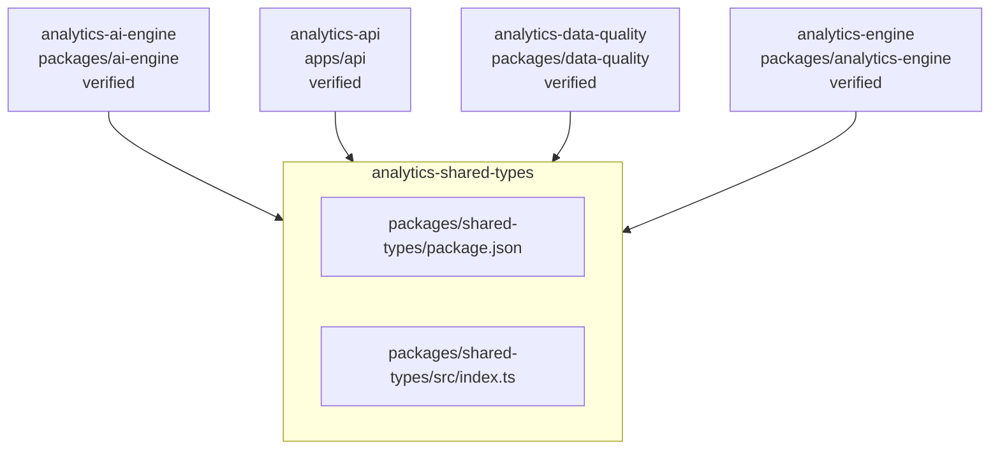

<!-- KAAF-GENERATED — do not edit by hand. Regenerate with scripts/architecture/generate.sh. -->

# Component — analytics-shared-types (C4 L3)

`analytics-shared-types` at `packages/shared-types` — confidence `verified`. 2 declared public entry point(s), 0 dependency(ies), 4 dependent(s).

**Reading this diagram**

- Solid arrow: a dependency declared in a `kaaf.module.json` manifest.
- Dotted arrow: a real import discovered in the source that no manifest declares — see `.ai/drift.json`.
- Node outline reflects confidence: solid = `verified`, dashed = `documented` or `derived`.
<!-- kaaf:bodyDigest=572a65378a3056d7d222e5176c307ea5be80c12c1c46155835ed0c3ce3d291ca -->
